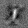
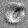

---
# This is a YAML preamble, defining pandoc meta-variables.
# Reference: https://pandoc.org/MANUAL.html#variables
# Change them as you see fit.
title: TDT4195 Assignment 1
author:
- Olof Ljunggren
date: \today # This is a latex command, ignored for HTML output
lang: en-US
papersize: a4
geometry: margin=4cm
toc: false
toc-title: "Table of Contents"
toc-depth: 2
numbersections: true
header-includes:
# The `atkinson` font, requires 'texlive-fontsextra' on arch or the 'atkinson' CTAN package
# Uncomment this line to enable:
#- '`\usepackage[sfdefault]{atkinson}`{=latex}'
colorlinks: true
links-as-notes: true
# The document is following this break is written using "Markdown" syntax
---

<!--
This is a HTML-style comment, not visible in the final PDF.
-->

# TDT4195 Image Processing Assignment 1

# Task 1: Theory, Spatial Filtering [2.4pt]

## Task 1.a 
[0.2pt] Explain in one sentence what sampling is.

- In image processing sampling is the spatial discreteization. Samplerate corresponds to pixelsize.

## Task 1.b
[0.2pt] Explain in one sentence what quantization is.

- Quantization is the discreteization of an image intensity. Corresponds to the specific intensity a pixel gets.

## Task 1.c
[0.4pt] Looking at an image histogram, how can you see that the image has high contrast?

- If there is a large diffrence between high and mid and low intensities. Which for a histogram means there is a lot of high and low intensity pixels and not very many in the grey zone inbetween. Should have a little bit of a u-shape.

## Task 1.d
[0.6pt] Perform histogram equalization by hand on the 3-bit (8 intensity levels) image in Figure 1a
Your report must include all the steps you did to compute the histogram, the transformation, and
the transformed image. Round down any resulting pixel intensities that are not integers (use the
floor operator).

## Task 1.e
[0.2pt] What happens to the dynamic range if we apply a log transform to an image with a large variance in pixel intensities?

- The log-transformation compresses the dynamic range. We get more detailed low intensities but less detailed high intensities.

## Task 1.f
[0.8pt] Perform spatial convolution by hand on the image in Figure 1a using the kernel in Figure 1b.
The convolved image should be 3 ×5. You are free to choose how you handle boundary conditions,
and state how you handle them in the report.

The boundaries was handled by padding with zeros equal to the floor(kernel_size/2). This makes that the image has the same size. Though we might lose some information in the edges.

# Task 2: Programming [1.6pt]

## Task 2.a
[0.3pt] Implement a function that converts an RGB image to grayscale. Use Equation 1. Implement this in the function greyscale.

## Task 2.b
[0.4pt] Implement a function that takes a grayscale image and applies the following intensity transformation T(p) = 1 − p. Implement this in the function inverse.

[0.9pt] Implement a function that takes an RGB image and a convolutional kernel as input, and performs 2D spatial convolution. Assume the size of the kernel is odd numbered, e.g. 3 × 3, 5 × 5, or 7 × 7. You must implement the convolution operation yourself from scratch. Implement the function in convolve_im.

# Task 3: Theory, Neural Networks [1.6pt]

## Task 3.a
Try to implement the logic gates AND, OR, NOT, NOR, NAND, or XOR in a single layert neural network. Given that all negative and zero outputs count as 0 and that all positive outputs counts as 1 we can construct every of these except XOR with a single layer network. 

Useful soruce: https://medium.com/@stanleydukor neural-representation-of-and-or-not-xor-and-xnor-logic-gates-perceptron-algorithm-b0275375fea1

## Task 3.b
A hyperparameter is values related to a nerual net which has to be initiated. For instance this can be the number of epochs and the batch size. One epoch corresponds for the model walking thorugh all the data one time. The batch size is the number of times the net skips to update the model parameters. So if batch equals two it will only train for "every second" value.  

## Task 3.c
[0.2pt] Why is the softmax activation functioned used in the last layer for neural networks trained to classify objects?

Softmax is the last layer of a neural net and has the same size as the output. This is used to create probabilities for a classifier. This makes it easier to make decisions from the data. Also it gives more information than just using max which will return zeros and a single one.

## Task 3.d
[0.7pt] Figure 2 shows a simple neural network. Perform a forward pass and backward pass on this network with the given input values. Use Equation 3 as the cost function and let the target value be y = 1.

## Task 3.e
[0.3pt] Compute the updated weights w1, w3, and b1 by using gradient descent and the values you found in task d. Use α = 0.1

# Task 4: Programming [2.4pt]

## Task 4.a
[0.6pt] Use the given starter code and train a single-layer neural network with batch size of 64. Then, normalize every image between a range of [-1. 1], and train the network again. Plot the training and validation loss from both of the networks in the same graph. Include the graph in your report. Do you notice any difference when training your network with/without normalization?

- It appears that the normalized network converges faster than the not normalized one. Although it seems that the training took a little bit more time when using normalization. Overall the biggest advantage is the faster and more consistent performance.

## Task 4.b
[0.6pt] The trained neural network will have one weight with shape [num classes, 28 × 28]. To visualize the learned weight, we can plot the weight as a 28 × 28 grayscale image. For each digit (0-9), plot the learned weight as a 28 × 28 image. In your report, include the image for each weight,and describe what you observe (1-2 sentences).

<!--  -->

- I began explaining each of the weights but then realized maybe you just wanted overall comments. So generally we have high weights for the written part / shape of the number. The other part is a low weight part which can help to distinguish characteristics.

- Number 0: The most important features here is the low value weights in middle corresponding to the hole in the zero. Also it seems like a round ring with higher weights.

- Number 1: Here it seems like the most important part is the vertical line in the middle. There is also smaller weights around to really discretize the line. 

- Number 2: For the two we can see a little bit of high values in the shape of a two. Though the most critical part looks to be the low weights for the pixels in the "upper hook".

- Number 3: Also here the shape of the high weights corresponds to the number three. Here we also have a low weight part which amplifies the shape of the number. In this case an arc.

<!-- 

 -->

## Task 4.c
[0.6pt] Set the learning rate to lr = 1.0, and train the network from scratch. Report the accuracy and average cross entropy loss on the validation set. In 1-2 sentences, explain why the network achieves worse/better accuracy than previously.

- Final Test loss: 2.8491579969802894. Final Test accuracy: 0.8631
- The reason the network performed worse is the too high learning rate. Ideally increaseing learning rate might just improve the speed of the convergence. Though in this case it seems like the network did not really converge to anything at all. It just oscillated around some point.

## Task 4.d
[0.6pt] Include an hidden layer with 64 nodes in the network, with ReLU as the activation function for the first layer. Train this network with the same hyperparameters as previously. Plot the training and validation loss from this network together with the loss from task (a). Include the plot in your report. What do you observe?

- In this case I observe a significantly better and fast convergence than the linear model. This makes some sense since the numbers can not really be describes linearly.